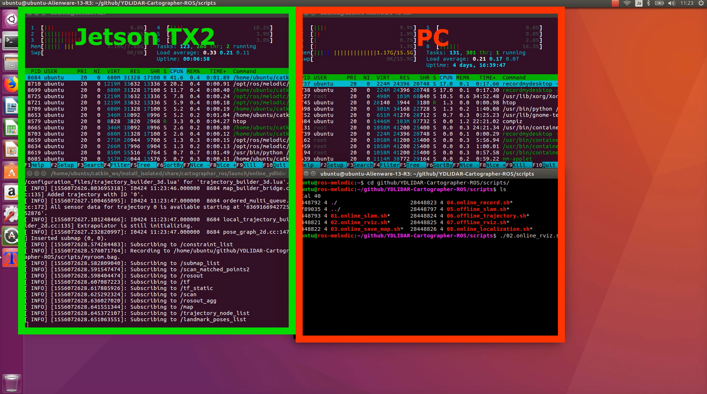
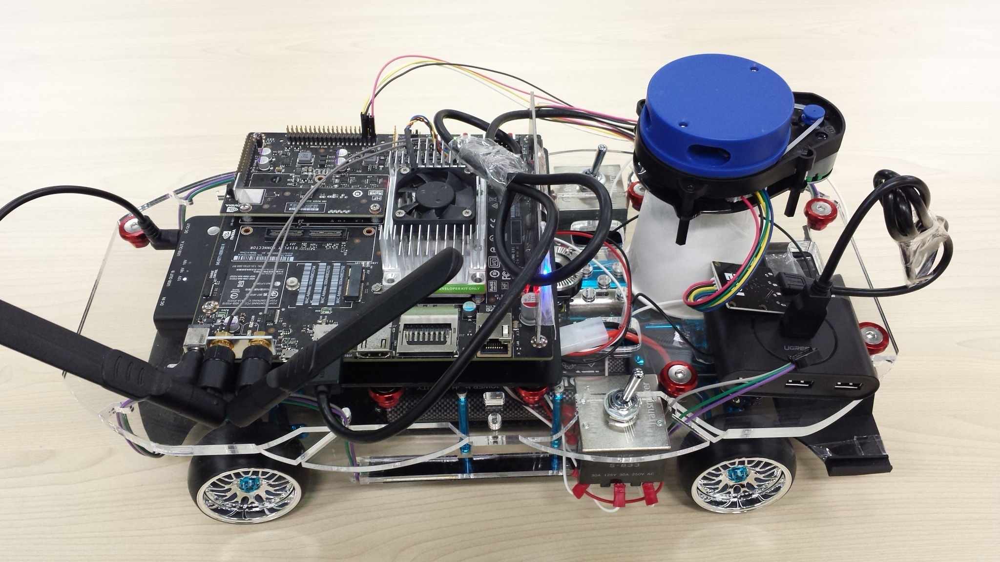
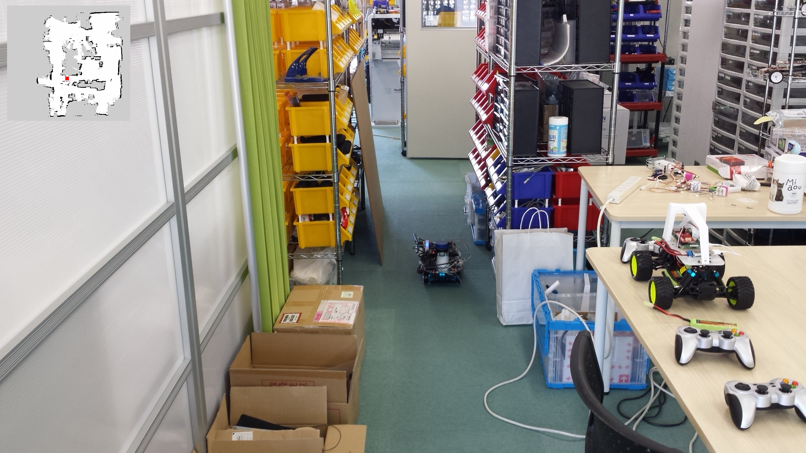

# Online SLAM

オンラインSLAMはリアルタイムSLAMのことです。<br>
マップ作成と、rosbagへの保存、マップの保存が可能です。<br>

## 動画
[](https://www.youtube.com/watch?v=t7SFfHgnNus)

## 起動
rosbagに保存する時、引数に保存するファイル名を指定します。拡張子は`.bag`にします。<br>
実行はTX2(car)でおこないます。
```
cd ~/github/YDLIDAR-Cartographer-ROS/scripts
./01.online_slam.sh myroom.bag
```
引数を与えない場合はrosbagに保存しません。<br>
```
cd ~/github/YDLIDAR-Cartographer-ROS/scripts
./01.online_slam.sh
```



## rviz
RVizはPCで起動します。<br>
TX2で実行したonline SLAMの起動を待ってから実行してください。<br>
```
./02.online_rviz.sh
```


## 走行
室内を2周してマップを完成させます。loop closureにより、1周よりも精度がよくなりやすいです<br>
自己位置推定は旋回に弱いので、出来るだけゆっくり走行します。（0.5km/h程度）

<br>
<br>

## マップ保存
### pbstream
pbstreamはCartographer-ROSでLocalization（自己位置推定）を実行する時に使います。<br>
引数で出力ファイルに指定するファイルの拡張は`.pbstream`にしてください。<br>
```
./03.online_save_pbstream.sh myroom.bag.pbstream
```

### ros map
ros mapはros navigationでLocalizationとPath Plannerを実行する時に使います。<br>
`rosmap_2d_yyyymmddhhmmss.pgm`とrosmap_2d_yyyymmddhhmmss.yaml`が作成されます。<br>
```
./04.online_save_rosmap.sh
```
<br>
rosmap_2d.yaml<br>
```
image: rosmap_2d.pgm
resolution: 0.050000
origin: [-8.979110, -11.103004, 0.000000]
negate: 0
occupied_thresh: 0.65
free_thresh: 0.196
```

## その他
### グラフ表示
ノードをグラフで表示
```
rosrun rqt_graph rqt_graph
```


## 説明

### 01.online_slam.sh
`01.online_slam.sh`ではいくつかの実行を行っています。<br>

ラジコンの走行中はモニターが見れないので、他のPCでRVizを起動出来るようにexportで環境変数を設定しています。<br>
`自分(tx2)のIP`はJetson TX2(car)のIPアドレスになります。<br>
```
export ROS_MASTER_URI=http://自分(tx2)のIP:11311
export ROS_IP=自分(tx2)のIP
source /home/ubuntu/catkin_ws/install_isolated/setup.bash
```
rosbagに保存する為のファイル名を引数から取得します。<br>
```
case $1 in
    /*\.bag)
        OUTPUT_BAG=$1
        ;;
    *.bag)
        OUTPUT_BAG=$PWD/$1
esac
```


roscoreを起動
```
roscore &
sleep 5 # wait until roscore launch
```

YDLIDARを起動
```
roslaunch ydlidar lidar.launch &
sleep 15 # wait until roscore launch
```
online SLAMを起動<br>
引数があるときはrosbagへの保存を実施。<br>
```
if [ -z ${OUTPUT_BAG} ]; then
    # ${OUTPUT_BAG} is empty.
    roslaunch cartographer_ros online_ydlidar_2d_slam.launch
else
    # Save to rosbag.
    roslaunch cartographer_ros online_ydlidar_2d_slam.launch &
    sleep 5
    rosrun rosbag record -a -O $OUTPUT_BAG
fi
```

### 02.online_rviz.sh
02.online_rviz.shは他のPC上で実行することになります。<br>
`roscoreを起動しているマシン(tx2)のIP`はJetson TX2(car)のIPアドレスになります。<br>
`自分(pc)のIP`は`02.online_rviz.sh`を実行するPCのIPアドレスになります。
```
export ROS_MASTER_URI=http://roscoreを起動しているマシン(tx2)のIP:11311
export ROS_ID=自分(pc)のIP
source /home/ubuntu/catkin_ws/install_isolated/setup.bash
```
rvizを起動
```
roslaunch cartographer_ros online_ydlidar_2d_rviz.launch
```
<br>

他のPCのROSバージョンが異なる場合は、RVizは`md5sum Error`が発生して正常に動作しない可能性があります。<br>
[https://answers.ros.org/question/261071/rviz-client-md5sum-error/](https://answers.ros.org/question/261071/rviz-client-md5sum-error/)<br>
Cartographer-rosは`master branch`を使うため、TX2とPCで同じコミットを利用する必要があります。<br>

## 03.online_save_pbstream.sh
走行後、pbstream形式で保存することが出来ます。<br>
```
./03.online_save_pbstream.sh output.pbstream
```
第一引数に出力用のファイル名を拡張子`.pbstream`で指定します。<br>
```
# usage:
# ./03.online_save_pbstream.sh output.pbstream

# https://github.com/googlecartographer/cartographer_ros/blob/master/docs/source/assets_writer.rst

case $1 in
    /*\.pbstream)
        OUTPUT_PB=$1
        ;;
    *.pbstream)
        OUTPUT_PB=$PWD/$1
esac
echo ${OUTPUT_PB}
```
環境変数を設定
```
export ROS_MASTER_URI=http://192.168.0.48:11311
export ROS_IP=192.168.0.48
source /home/ubuntu/catkin_ws/install_isolated/setup.bash

```
online SLAMの更新を停止
```
rosservice call /finish_trajectory 0
```
pbstream形式でマップを保存<br>
```
rosservice call /write_state "{filename: '${OUTPUT_PB}', include_unfinished_submaps: true}"
```
公式ドキュメントでは`include_unfinished_submaps: 'true'`となっていますが、trueは文字列型`'true'`ではなくbool型`true`である必要があるため、bool型の`true`指定します。`true`の代わりに`1`でも可能です。<br>

## 04.online_save_rosmap.sh
走行後、ros mapとして保存することが出来ます。<br>
`rosmap_2d_yyyymmddhhmmss.pgm`とrosmap_2d_yyyymmddhhmmss.yaml`が作成されます。<br>
pgmファイルは画像ファイルなので、`gimp`を使ってpngファイルに変換することが出来ます。<br>
実行は、`01.online.sh`を終了する前におこないます。<br>
```
./04.online_save_rosmap.sh
```

```
export ROS_MASTER_URI=http://roscoreを起動しているマシンのIP:11311
export ROS_ID=自分のIP
source /home/ubuntu/catkin_ws/install_isolated/setup.bash
```

ros mapとして保存
```
DATE=`date '+%Y%m%d%H%M%S'`

rosrun map_server map_saver -f ./map/gridmap_2d_${DATE}
```

合成画像：<br>

