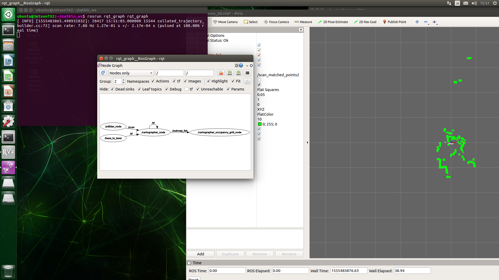

# Online SLAM

オンラインSLAMはリアルタイムSLAMのことです。<br>
CartographerではYDLIDARの動作確認のために使います。<br>
この方法ではpbstream形式で保存出来ないため、Cartographerでマップを読み込んで自己位置推定を行うことは出来ません。<br>
ros mapとして保存することは可能です。<br>

## 起動
```
cd ~/github/YDLIDAR-Cartographer-ROS/scripts
./01.online_slam.sh
```


## rviz
```
./02.rviz.sh
```


## 走行
室内を移動してマップを完成させます。<br>
<br>
<br>


## ros map保存
`gridmap_2d.pgm`とgridmap_2d.yaml`が作成されます。<br>
```
./03.save_to_map.sh
```
<br>
gridmap_2d.yaml<br>
```
image: ./map/gridmap_2d.pgm
resolution: 0.050000
origin: [-8.979110, -11.103004, 0.000000]
negate: 0
occupied_thresh: 0.65
free_thresh: 0.196

```

## グラフ表示
ノードをグラフで表示
```
rosrun rqt_graph rqt_graph
```



## 説明

### 01.online_slam.sh
`01.online_slam.sh`ではいくつかの実行を行っています。<br>

ラジコンの走行中はモニターが見れないので、他のPCでRVizを起動出来るようにexportを有効にすることが出来ます。<br>
```
export ROS_MASTER_URI=http://自分のIP:11311
export ROS_IP=自分のIP
source /home/ubuntu/catkin_ws/install_isolated/setup.bash
```

roscoreを起動
```
roscore &
sleep 5 # wait until roscore launch
```

YDLIDARを起動
```
roslaunch ydlidar lidar.launch &
sleep 15 # wait until roscore launch
```
online SLAMを起動
```
roslaunch cartographer_ros ydlidar_2d.launch
```

### 02.rviz.sh
他のPCでRVizを起動する場合は、exportを有効にします。<br>
この場合、02.rviz.shは他のPC上で実行することになります。<br>
```
export ROS_MASTER_URI=http://roscoreを起動しているマシンのIP:11311
export ROS_ID=自分のIP
source /home/ubuntu/catkin_ws/install_isolated/setup.bash
```
rvizを起動
```
roslaunch cartographer_ros ydlidar_2d_rviz.launch
```
<br>


## 03.save_to_map.sh
走行後、ros mapとして保存することが出来ます。<br>
`gridmap_2d.pgm`とgridmap_2d.yaml`が作成されます。<br>
pgmファイルは画像ファイルなので、`gimp`を使ってpngファイルに変換することが出来ます。<br>
```
mkdir map
```

他のPCで実行する場合は、exportを有効にします。<br>
```
export ROS_MASTER_URI=http://roscoreを起動しているマシンのIP:11311
export ROS_ID=自分のIP
source /home/ubuntu/catkin_ws/install_isolated/setup.bash
```

ros mapとして保存
```
DATE=`date '+%Y%m%d%H%M%S'`

rosrun map_server map_saver -f ./map/gridmap_2d_${DATE}
```

合成画像：<br>

