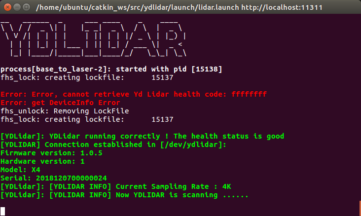

# YLiDARとCartographer連携

## YDLiDARパラメータ変更

### lidar.launch
vi ~/catkin_ws/src/ydlidar/launch/lidar.launch<br>
diffコマンドの結果:<br>
```
diff -u ~/catkin_ws/src/ydlidar/launch/lidar.launch.org ~/catkin_ws/src/ydlidar/launch/lidar.launch
--- /home/ubuntu/catkin_ws/src/ydlidar/launch/lidar.launch.org	2019-04-17 13:59:25.209638390 +0900
+++ /home/ubuntu/catkin_ws/src/ydlidar/launch/lidar.launch	2019-04-17 14:54:00.263965585 +0900
@@ -9,12 +9,12 @@
     <param name="reversion"    type="bool"   value="false"/>
     <param name="angle_min"    type="double" value="-180" />
     <param name="angle_max"    type="double" value="180" />
-    <param name="range_min"    type="double" value="0.1" />
+    <param name="range_min"    type="double" value="0.08" />
     <param name="range_max"    type="double" value="16.0" />
     <param name="ignore_array" type="string" value="" />
     <param name="samp_rate"    type="int"    value="9"/>
-    <param name="frequency"    type="double" value="7"/>
+    <param name="frequency"    type="double" value="15"/>
   </node>
-  <node pkg="tf" type="static_transform_publisher" name="base_link_to_laser4"
-    args="0.2245 0.0 0.2 0.0 0.0  0.0 /base_footprint /laser_frame 40" />
+  <node pkg="tf" type="static_transform_publisher" name="base_to_laser"
+    args="0.0 0.0 0.18 0.0 0.0  0.0 /base_link /laser_frame 100" />
 </launch>
```

### 値を反映します。<br>
```
cd ~/catkin_ws
catkin_make_isolated --install --use-ninja
source install_isolated/setup.bash
```

## Cartographerパラメータ変更

### demo_revo_lds.launch
cartographerはdemoを修正して使うことにします。<br>
ポイントはremapがfromとto共にscanになることです。<br>
一番最後のrosbag playは消してリアルタイムSLAMとして使います。<br>
sudo vi /opt/ros/melodic/share/cartographer_ros/launch/demo_revo_lds.launch<br>
diffコマンドの結果:<br>
```
--- /opt/ros/melodic/share/cartographer_ros/launch/demo_revo_lds.launch.org	2019-04-17 13:16:05.360885434 +0900
+++ /opt/ros/melodic/share/cartographer_ros/launch/demo_revo_lds.launch	2019-04-17 14:43:28.350731814 +0900
@@ -22,7 +22,7 @@
           -configuration_directory $(find cartographer_ros)/configuration_files
           -configuration_basename revo_lds.lua"
       output="screen">
-    <remap from="scan" to="horizontal_laser_2d" />
+    <remap from="scan" to="scan" />
   </node>
 
   <node name="cartographer_occupancy_grid_node" pkg="cartographer_ros"
@@ -30,6 +30,4 @@
 
   <node name="rviz" pkg="rviz" type="rviz" required="true"
       args="-d $(find cartographer_ros)/configuration_files/demo_2d.rviz" />
-  <node name="playbag" pkg="rosbag" type="play"
-      args="--clock $(arg bag_filename)" />
 </launch>
```

### revo_lds.lua

sudo vi /opt/ros/melodic/share/cartographer_ros/configuration_files/revo_lds.lua<br>
diffコマンドの結果:<br>
```
--- /opt/ros/melodic/share/cartographer_ros/configuration_files/revo_lds.lua.org2019-04-17 13:54:39.108638478 +0900
+++ /opt/ros/melodic/share/cartographer_ros/configuration_files/revo_lds.lua	2019-04-17 14:54:50.892098740 +0900
@@ -19,8 +19,8 @@
   map_builder = MAP_BUILDER,
   trajectory_builder = TRAJECTORY_BUILDER,
   map_frame = "map",
-  tracking_frame = "horizontal_laser_link",
-  published_frame = "horizontal_laser_link",
+  tracking_frame = "laser_frame",
+  published_frame = "laser_frame",
   odom_frame = "odom",
   provide_odom_frame = true,
   publish_frame_projected_to_2d = false,
@@ -45,8 +45,8 @@
 MAP_BUILDER.use_trajectory_builder_2d = true
 
 TRAJECTORY_BUILDER_2D.submaps.num_range_data = 35
-TRAJECTORY_BUILDER_2D.min_range = 0.3
-TRAJECTORY_BUILDER_2D.max_range = 8.
+TRAJECTORY_BUILDER_2D.min_range = 0.08
+TRAJECTORY_BUILDER_2D.max_range = 16.
 TRAJECTORY_BUILDER_2D.missing_data_ray_length = 1.
 TRAJECTORY_BUILDER_2D.use_imu_data = false
 TRAJECTORY_BUILDER_2D.use_online_correlative_scan_matching = true
```


## 環境変数の設定
他のPCからアクセス可能にする場合は、`roscore`を実行する前に環境変数を設定します。<br>
```
$ export ROS_MASTER_URI=http://自分のIP:11311
$ export ROS_IP=自分のIP
```

## 起動
```
$ roscore &
```
roscoreが起動するまで待ちます。<br>
```
$ roslaunch ydlidar lidar.launch &
```
ydlidarが起動するまで待ちます。<br>
<br>
```
$ roslaunch cartographer_ros demo_revo_lds.launch
```
<br>

## グラフ

グラフを表示
```
$ rosrun rqt_graph rqt_graph
```
<br>

## 他のPCからの接続

### rvizを用意
sudo vi /opt/ros/melodic/share/cartographer_ros/launch/demo_rviz.launch
```xml
<launch>
  <param name="/use_sim_time" value="true" />

  <node 
    name="rviz" 
    pkg="rviz" 
    type="rviz" 
    required="true"
    args="-d $(find cartographer_ros)/configuration_files/demo_2d.rviz">
  </node>

</launch>
```

### 環境編数
```
$ export ROS_MASTER_URI=http://roscoreを起動しているマシンのIP:11311
$ export ROS_ID=roscoreを起動しているマシンのIP
```
### rvizを起動
```
$ roslaunch cartographer_ros demo_rviz.launch
```

## 参考

* [https://www.youtube.com/watch?v=4ipDP9dIYYs](https://www.youtube.com/watch?v=4ipDP9dIYYs)
* [https://qiita.com/PINTO/items/4845c438cac05eda4d1e](https://qiita.com/PINTO/items/4845c438cac05eda4d1e)
* [https://www.mindthink.me/2018/11/01/cartographer%E5%AD%A6%E4%B9%A0%E7%B3%BB%E5%88%97%E4%B9%8B%E4%BA%8C%EF%BC%9A-%E4%BD%BF%E7%94%A8-eai-ydlidar-%E5%AE%9E%E7%8E%B0-cartographer-2d-slam/](https://www.mindthink.me/2018/11/01/cartographer%E5%AD%A6%E4%B9%A0%E7%B3%BB%E5%88%97%E4%B9%8B%E4%BA%8C%EF%BC%9A-%E4%BD%BF%E7%94%A8-eai-ydlidar-%E5%AE%9E%E7%8E%B0-cartographer-2d-slam/)

