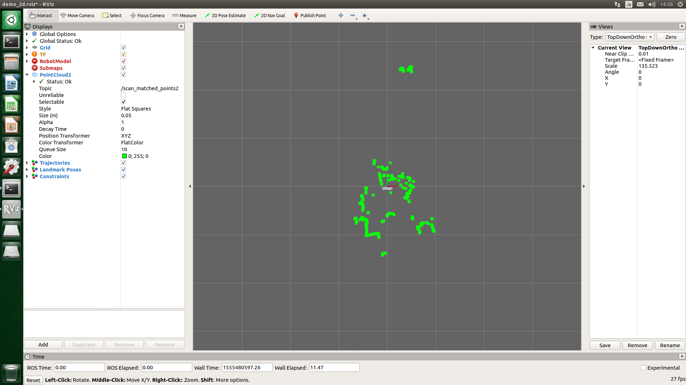
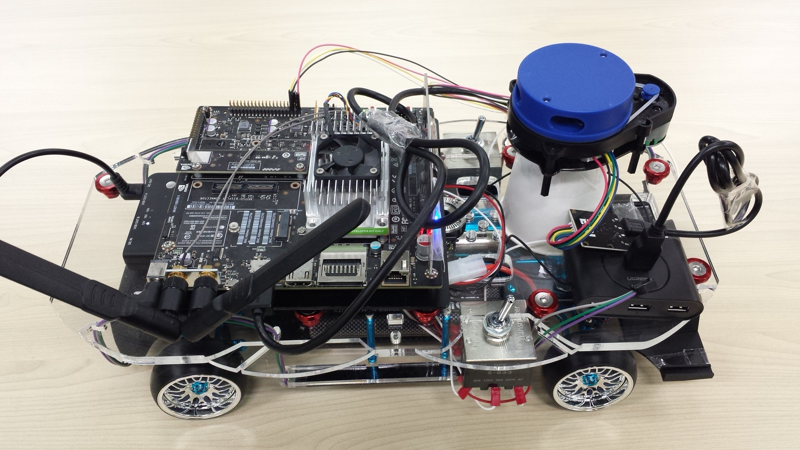

# Cartographer/YDLIDAR 2Dマップ保存

## 起動
まずは起動します。<br>
```
$ export ROS_MASTER_URI=http://自分のIP:11311
$ export ROS_IP=自分のIP
$ roscore &
$ roslaunch ydlidar lidar.launch &
$ roslaunch cartographer_ros demo_revo_lds.launch &
```

走行中にマップの作製具合を確認したいので、他のPCでRVizを起動します。<br>
```
$ export ROS_MASTER_URI=http://roscoreを起動しているマシンのIP:11311
$ export ROS_ID=自分のIP
$ roslaunch cartographer_ros demo_rviz.launch
```
<br>

## 走行
ラジコンに乗せて部屋の中を移動してマップを作成していきます。<br>
<br>

## 保存
走行後、マップを保存します。<br>
他のPCで起動したRVizの画面:<br>
<br>

```
$ mkdir ~/map
$ rosrun map_server map_saver -f ~/map/lidar_2d
```
`lidar_2d.pgm`と`lidar_2d.yaml`が作成されます。<br>
<br>
lidar_2d.yaml<br>
```
image: /home/ubuntu/map/lidar_2d.pgm
resolution: 0.050000
origin: [-10.260829, -12.100000, 0.000000]
negate: 0
occupied_thresh: 0.65
free_thresh: 0.196

```