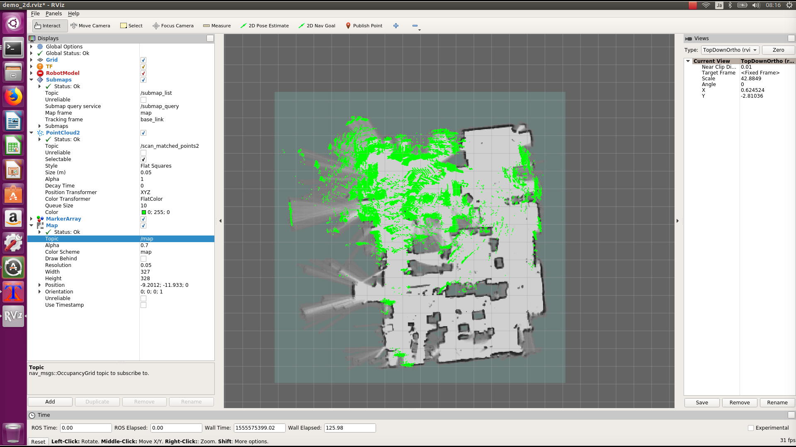

# 自己位置推定

## 実行
```
cd ~/github/YDLIDAR-Cartographer-ROS/scripts
./06.localization.sh myroom.bag.pbstream
```

## RViz
RVizは他のPCで起動する時は、スクリプト内にあるIPアドレス設定をおこなってください。<br>
```
./02.rviz.sh
```
<br>

## 走行
ラジコンに乗せて部屋の中を移動します。<br>
<br>
[](https://www.youtube.com/watch?v=qhoVwlwEMwQ)

## 説明

### Localizationとは？
Localizationとは、マップの中で自分の位置を推定することです。<br>
動画の初期には位置ずれが発生しています。<br>
少し走行すると、動画の最後にはマップの中で自分の位置が正確に判明していることがわかります。これがLocalizationの機能です。<br>
[](https://www.youtube.com/watch?v=hTvcx-LZyx4)

### 06.localization.sh
引数にマップデータを指定します。<br>
```
./06.localization.sh input.bag.pbstream
```

```
# usage:
# ./localization.sh input.bag.pbstream

case $1 in
    /*\.pbstream)
        INPUT_PB=$1
        ;;
    *.pbstream)
        INPUT_PB=$PWD/$1
esac
echo ${INPUT_PB}
```

ラジコンの走行中はモニターが見れないので、他のPCでRVizを起動出来るようにexportを有効にすることが出来ます。<br>
```
export ROS_MASTER_URI=http://自分のIP:11311
export ROS_IP=自分のIP
source /home/ubuntu/catkin_ws/install_isolated/setup.bash
```
roscoreを起動
```
roscore &
sleep 5 # wait until roscore launch
```
YDLIDARを起動
```
roslaunch ydlidar lidar.launch &
sleep 15 # wait until ydlidar launch
```
Localizationを起動
```
roslaunch cartographer_ros ydlidar_2d_localization.launch load_state_filename:=${INPUT_PB}
```

### 02.rviz.sh
他のPCでRVizを起動する場合は、exportを有効にします。<br>
この場合、02.rviz.shは他のPC上で実行することになります。<br>
```
export ROS_MASTER_URI=http://roscoreを起動しているマシンのIP:11311
export ROS_ID=自分のIP
source /home/ubuntu/catkin_ws/install_isolated/setup.bash
```
rvizを起動
```
roslaunch cartographer_ros ydlidar_2d_rviz.launch
```
<br>
