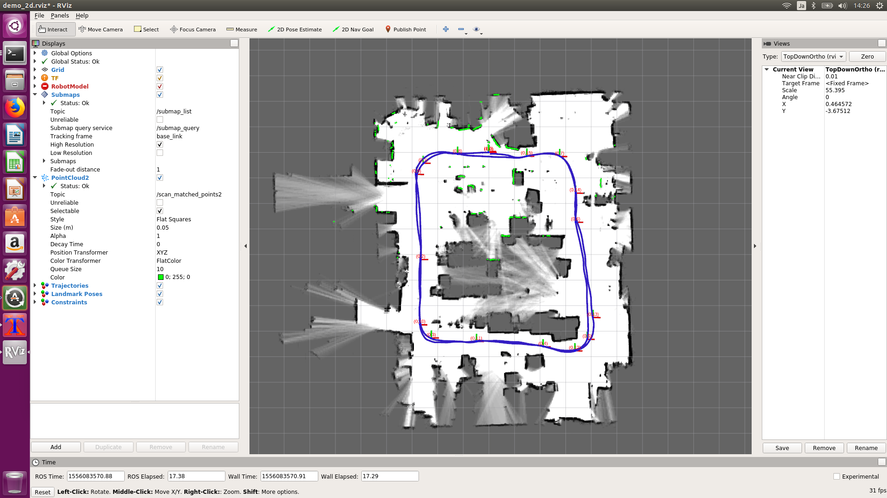

# 自己位置推定

自己位置推定は、読み込んだマップの中のどこに居るのかを推定する機能のことになります。<br>
初期位置として、マップ作成時の初期位置に合わせておくことが望ましいです。<br>
初期位置が不一致した状態では、うまく認識することが出来ません。<br>
また、回転に対して極端に弱いため、カーブはゆっくり走行する必要があります。<br>

## 動画
[](https://www.youtube.com/watch?v=gQTDASVGWfs)


## 実行
TX2(car)で実行<br>
```
cd ~/github/YDLIDAR-Cartographer-ROS/scripts
./08.online_localization.sh myroom.bag.pbstream
```

## RViz
RVizは他のPCで起動します。<br>
```
./02.online_rviz.sh
```
<br>

## 走行
ラジコンに乗せて部屋の中を移動します。<br>
[](https://www.youtube.com/watch?v=gQTDASVGWfs)

## 説明

### 08.online_localization.sh
リアルタイム自己位置推定を実行します。<br>
引数にマップデータを指定します。<br>
```
./08.online_localization.sh input.bag.pbstream
```

```
# usage:
# ./08.online_localization.sh input.bag.pbstream

case $1 in
    /*\.pbstream)
        INPUT_PB=$1
        ;;
    *.pbstream)
        INPUT_PB=$PWD/$1
esac
echo ${INPUT_PB}
```

ラジコンの走行中はモニターが見れないので、他のPCでRVizを起動出来るようにexportを有効にすることが出来ます。<br>
```
export ROS_MASTER_URI=http://自分(tx2)のIP:11311
export ROS_IP=自分(tx2)のIP
source /home/ubuntu/catkin_ws/install_isolated/setup.bash
```
roscoreを起動
```
roscore &
sleep 5 # wait until roscore launch
```
YDLIDARを起動
```
roslaunch ydlidar lidar.launch &
sleep 15 # wait until ydlidar launch
```
Localizationを起動
```
roslaunch cartographer_ros online_ydlidar_2d_localization.launch load_state_filename:=${INPUT_PB}
```

### 02.online_rviz.sh
RVizはPCで実行します。<br>
```
export ROS_MASTER_URI=http://roscoreを起動しているマシン(tx2)のIP:11311
export ROS_ID=自分(px)のIP
source /home/ubuntu/catkin_ws/install_isolated/setup.bash
```
rvizを起動
```
roslaunch cartographer_ros online_ydlidar_2d_rviz.launch
```
<br>
