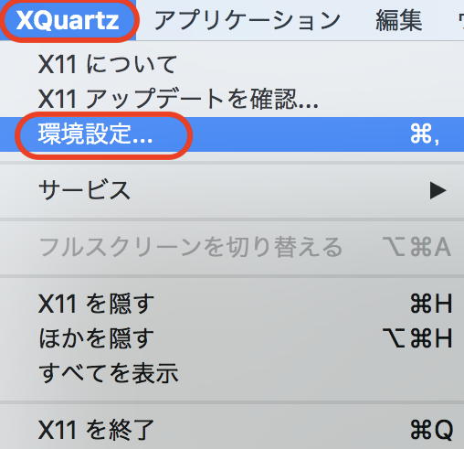
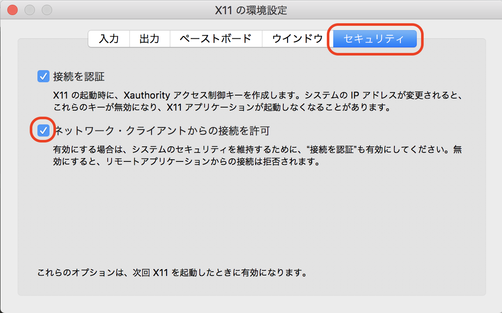

# X Windows

## XQuartsをインストール

[https://www.xquartz.org/](https://www.xquartz.org/)

起動する
```
$ xhost
```





## Dockerを取得

localを追加
```
$ xhost +127.0.0.1
```

DISPLAYの環境編数をつけてDocker読み込み
```
$ docker pull ubuntu:18.04
$ docker run -env DISPLAY=docker.for.mac.localhost:0 --env=QT_X11_NO_MITSHM=1 -it ubuntu:18.04
```